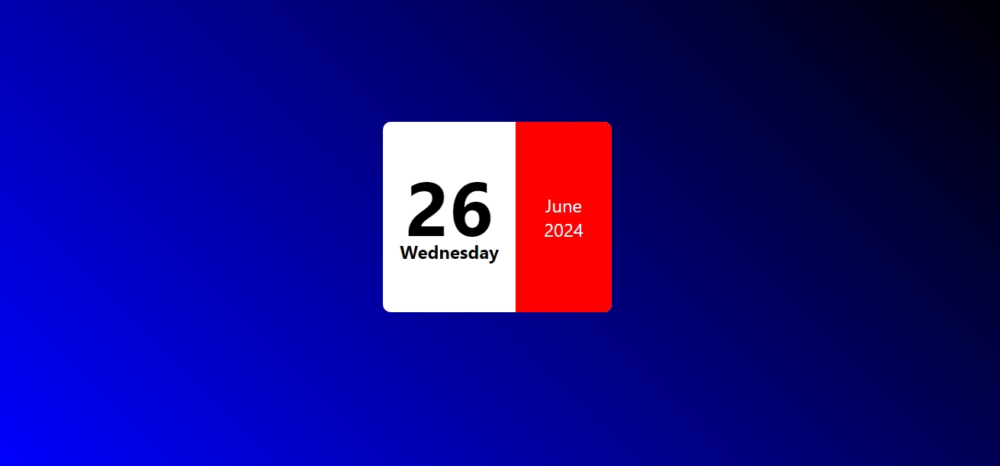

# Mini Calendar

## Features:

* It shows the current date, day, Month and Year.

* It updates the date, day, month and year continuesly using javascript.

### HTML:

* created calendar with date and day in halfside of the calender.

* created other half with Month and Year. 

### CSS :
* Applied linear gradient for the background of calendar.

* partitioned the calender with 2 halfs and showing difference with colours.

* Applied font differences and text differences for appearance. 

## Javascript

### Linked Date, Day, Month and Year to Javascript

* By givings id's for Date, Day, Month and Year to link the javascript.

### Updating Date, Day, Month and year

* For updation of Date took a Date menthod.

* From date method updating day,month,year by day method,date method, Month method and Full year method.

# Showing Day and Month in Text

* For the days stored the days in array and applied array for the day variable.

* For the Months stored the months in array and applied array for the month variable.

* For single digit values of date it shows single value. For that applied condition less than 10 it adds Zero before.

